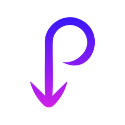
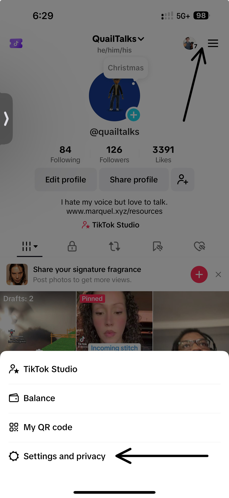
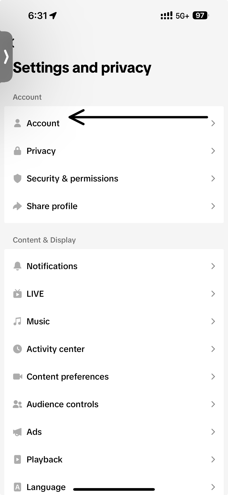
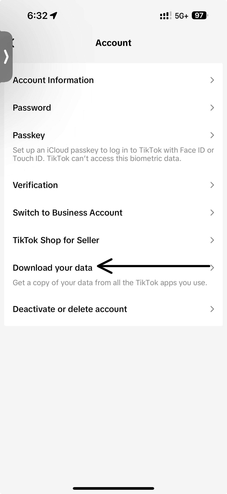
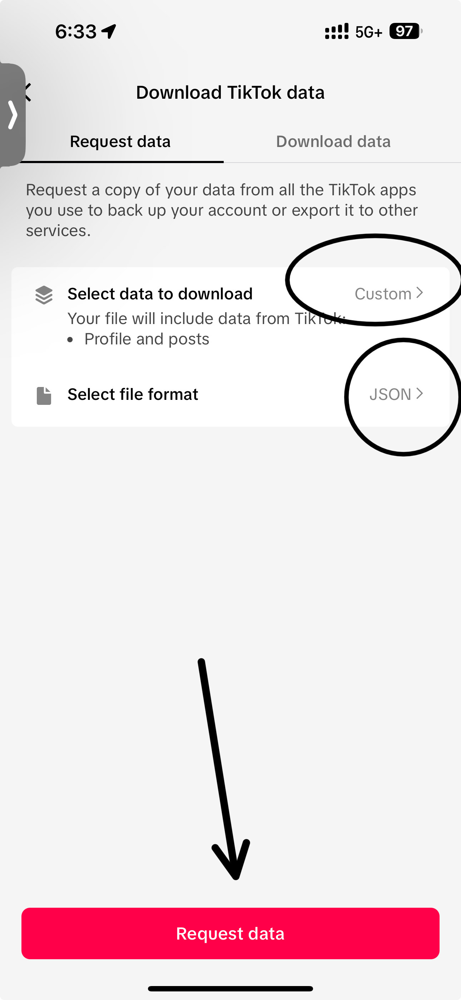
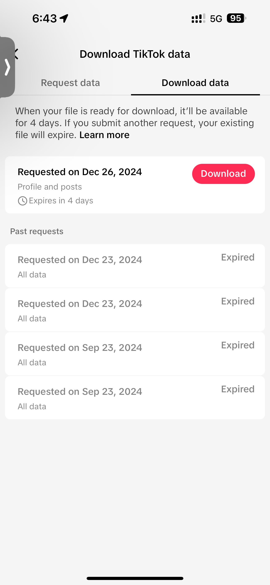

<!-- Improved compatibility of back to top link: See: https://github.com/othneildrew/Best-README-Template/pull/73 -->

<!--
*** Thanks for checking out the Best-README-Template. If you have a suggestion
*** that would make this better, please fork the repo and create a pull request
*** or simply open an issue with the tag "enhancement".
*** Don't forget to give the project a star!
*** Thanks again! Now go create something AMAZING! :D
-->

<!-- PROJECT SHIELDS -->
<!--
*** I'm using markdown "reference style" links for readability.
*** Reference links are enclosed in brackets [ ] instead of parentheses ( ).
*** See the bottom of this document for the declaration of the reference variables
*** for contributors-url, forks-url, etc. This is an optional, concise syntax you may use.
*** https://www.markdownguide.org/basic-syntax/#reference-style-links
-->
[![Contributors][contributors-shield]][contributors-url]
[![Forks][forks-shield]][forks-url]
[![Stargazers][stars-shield]][stars-url]
[![Issues][issues-shield]][issues-url]
[![project_license][license-shield]][license-url]
[![LinkedIn][linkedin-shield]][linkedin-url]

<!-- PROJECT LOGO -->
 

  

<h3 align="center">Tiktok Video Downloader</h3>

  

    A tool to automate backing up your tiktoks.
     
    <a href="https://github.com/msrogers2015/Tiktok-Video-Downloader"><strong>Explore the docs »</strong></a>
     
     
    <a href="https://github.com/msrogers2015/Tiktok-Video-Downloader">View Demo</a>
    ·
    <a href="https://github.com/msrogers2015/Tiktok-Video-Downloader/issues/new?labels=bug&template=bug-report---.md">Report Bug</a>
    ·
    <a href="https://github.com/msrogers2015/Tiktok-Video-Downloader/issues/new?labels=enhancement&template=feature-request---.md">Request Feature</a>
  

<!-- TABLE OF CONTENTS -->

  
Table of Contents

  <ol>
    <li>
      <a href="#about-the-project">About The Project</a>
      <ul>
        <li><a href="#built-with">Built With</a></li>
      </ul>
    </li>
    <li>
      <a href="#getting-started">Getting Started</a>
      <ul>
        <li><a href="#prerequisites">Prerequisites</a></li>
        <li><a href="#installation">Installation</a></li>
      </ul>
    </li>
    <li><a href="#usage">Usage</a></li>
    <li><a href="#contributing">Contributing</a></li>
    <li><a href="#license">License</a></li>
    <li><a href="#contact">Contact</a></li>
    <li><a href="#acknowledgments">Acknowledgments</a></li>
  </ol>

<!-- ABOUT THE PROJECT -->
## About The Project

I have over 200 videos posted on tiktok that I want to save before the ban. So i created something to automate downloading all my videos.

(<a href="#readme-top">back to top</a>)

### Built With

* [![Python][Python]][Python-url]

(<a href="#readme-top">back to top</a>)

<!-- GETTING STARTED -->
## Getting Started

### Prerequisites

The only non-standard package needed is the `requests` package.

### Installation

Download the zip file, unpack and run the application.

If you want, you can download the source code. Python 3.12 is required.

(<a href="#readme-top">back to top</a>)

<!-- USAGE EXAMPLES -->
## Usage
 
First, you will need to export your data from tiktok. This will produce a json file. 
 
 
Go to the Settings and Privacy menu

Click Account from the menu

Click "Download your data"

Change the "Select data to download" to custom and pick only your "Profile and post" to download.
Change the "Select file format" to JSON then click the "Request Data" button.

Once done, you will be able to download a zip file with the required json file.

Once you have your data, simply load the json file, select an output folder and click the download button.
<video width="960" height="540" controls>
  <source src="https://youtu.be/d_hq79rQKCk" type="video/mp4">
</video>

(<a href="#readme-top">back to top</a>)

<!-- CONTRIBUTING -->
## Contributing

Feel free to fork this repo, but as this is a simple proof of concept project for me, I am not seeking additional contributions at this time. If the project grows into something more, I may open up contributions.

<!-- LICENSE -->
## License

Distributed under the GPL-3.0 license. See `LICENSE.txt` for more information.

(<a href="#readme-top">back to top</a>)

<!-- ACKNOWLEDGMENTS -->
## Acknowledgments
Logo sourced from [IconScout](https://iconscout.com/free-icon/download-arrow-4604444). No altercations were made.

(<a href="#readme-top">back to top</a>)

<!-- MARKDOWN LINKS & IMAGES -->
<!-- https://www.markdownguide.org/basic-syntax/#reference-style-links -->
[contributors-shield]: https://img.shields.io/github/contributors/msrogers2015/Tiktok-Video-Downloader.svg?style=for-the-badge
[contributors-url]: https://github.com/msrogers2015/Tiktok-Video-Downloader/graphs/contributors
[forks-shield]: https://img.shields.io/github/forks/msrogers2015/Tiktok-Video-Downloader.svg?style=for-the-badge
[forks-url]: https://github.com/msrogers2015/Tiktok-Video-Downloader/network/members
[stars-shield]: https://img.shields.io/github/stars/msrogers2015/Tiktok-Video-Downloader.svg?style=for-the-badge
[stars-url]: https://github.com/msrogers2015/Tiktok-Video-Downloader/stargazers
[issues-shield]: https://img.shields.io/github/issues/msrogers2015/Tiktok-Video-Downloader.svg?style=for-the-badge
[issues-url]: https://github.com/msrogers2015/Tiktok-Video-Downloader/issues
[license-shield]: https://img.shields.io/github/license/msrogers2015/Tiktok-Video-Downloader.svg?style=for-the-badge
[license-url]: https://github.com/msrogers2015/Tiktok-Video-Downloader/blob/master/LICENSE.txt
[linkedin-shield]: https://img.shields.io/badge/-LinkedIn-black.svg?style=for-the-badge&logo=linkedin&colorB=555
[linkedin-url]: https://linkedin.com/in/linkedin_username
[product-screenshot]: images/screenshot.png
[Python]: https://img.shields.io/badge/python-4A4A55?style=for-the-badge&logo=python
[Python-url]: https://www.python.org/
[Next.js]: https://img.shields.io/badge/next.js-000000?style=for-the-badge&logo=nextdotjs&logoColor=white
[Next-url]: https://nextjs.org/
[React.js]: https://img.shields.io/badge/React-20232A?style=for-the-badge&logo=react&logoColor=61DAFB
[React-url]: https://reactjs.org/
[Vue.js]: https://img.shields.io/badge/Vue.js-35495E?style=for-the-badge&logo=vuedotjs&logoColor=4FC08D
[Vue-url]: https://vuejs.org/
[Angular.io]: https://img.shields.io/badge/Angular-DD0031?style=for-the-badge&logo=angular&logoColor=white
[Angular-url]: https://angular.io/
[Svelte.dev]: https://img.shields.io/badge/Svelte-4A4A55?style=for-the-badge&logo=svelte&logoColor=FF3E00
[Svelte-url]: https://svelte.dev/
[Laravel.com]: https://img.shields.io/badge/Laravel-FF2D20?style=for-the-badge&logo=laravel&logoColor=white
[Laravel-url]: https://laravel.com
[Bootstrap.com]: https://img.shields.io/badge/Bootstrap-563D7C?style=for-the-badge&logo=bootstrap&logoColor=white
[Bootstrap-url]: https://getbootstrap.com
[JQuery.com]: https://img.shields.io/badge/jQuery-0769AD?style=for-the-badge&logo=jquery&logoColor=white
[JQuery-url]: https://jquery.com 
